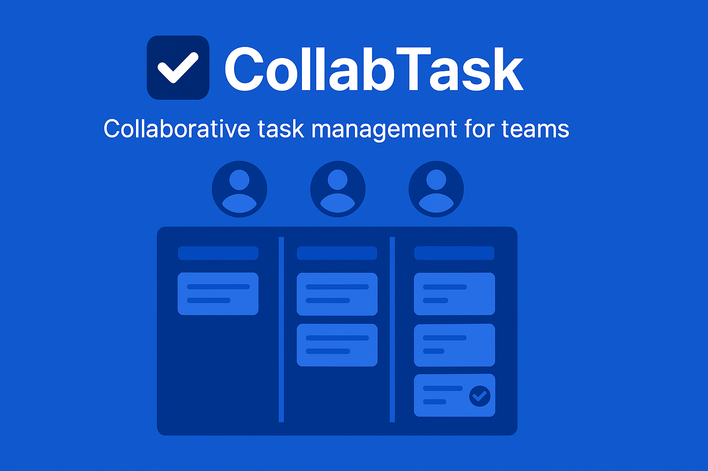

# CollabTask

**CollabTask** es una plataforma colaborativa tipo Trello, diseñada para facilitar la gestión de tareas en equipos de trabajo organizados. Utiliza [Clerk](https://clerk.com) para la autenticación avanzada y gestión de organizaciones.



## Demo

[Accede a la demo en Vercel](https://collabtask.vercel.app)

---

## Características

- Inicio de sesión y registro con Clerk
- Soporte completo de **organizaciones** mediante Clerk Organizations
- Gestión de **tableros** por equipo
- Creación, edición y asignación de **tareas**
- **Vistas Kanban** para ver tareas según su estado
- Comentarios en cada tarea
- Filtro por miembro asignado y estado
- Cambiar entre equipos fácilmente con `<OrganizationSwitcher />`

---

## ¿Cómo se utiliza Clerk?

Este proyecto aprovecha **Clerk** de forma avanzada:

- **Autenticación**: Inicio de sesión, cierre de sesión, gestión de sesión con `<UserButton />`
- **Organizaciones**: Cada equipo de trabajo es una organización Clerk
- **Filtrado por `orgId`**: Los tableros y tareas están asociados a una organización
- **Miembros de organización**: Solo los miembros pueden ver y colaborar en los tableros
- **Cambio entre organizaciones**: Se implementa con `<OrganizationSwitcher />`
- **Supabase**: Integración con Supabase como third-party auth provider

---

## Capturas

> En desarrollo - próximamente

- `/dashboard` con tableros
- Vista kanban
- Modal de nueva tarea
- Comentarios de tareas
- Cambio de organización

---

## Tecnologías utilizadas

- [Next.js 15](https://nextjs.org/)
- [Clerk](https://clerk.dev)
- [Tailwind 4](https://tailwindcss.com/)
- [Shadcn/ui](https://ui.shadcn.com/) (para componentes rápidos)
- [Supabase](https://supabase.com/) como backend

---

## Cómo correr localmente

1. Clona el repositorio:

```bash
git clone https://github.com/danny1998cuba/collabtask.git
cd collabtask
```

2. Instala dependencias:

```bash
npm install
```

3. Crea un archivo .env.local con tus claves de Clerk a partir del archivo .env.example

4. Inicia el servidor

```bash
npm run dev
```

## Licencia

MIT

## Autor

Daniel González Cuétara – [@danny1998cuba]("https://github.com/danny1998cuba")

Este proyecto fue desarrollado como parte de un hackatón con enfoque en el uso avanzado de Clerk.
